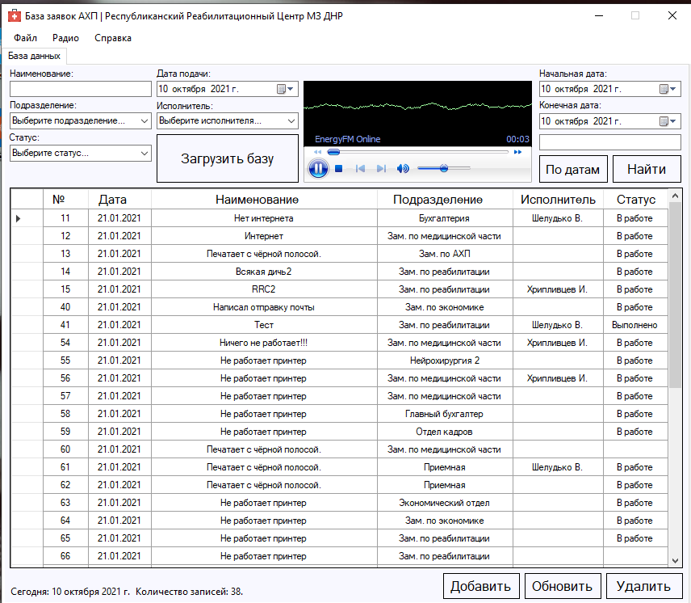

# АСПОЗ - Автоматизированная система подачи и обработки заявок

Система предназначена для подачи, регистрации и учета заявок на выполнение каких-либо работ 
(ремонтных и т.д.). Данные хранятся в MySQL. Общий поиск по базе, поиск по дате и конкретному периоду. Вывод данных на печать, экспорт данных в Excel.
Есть встроенное радио.

